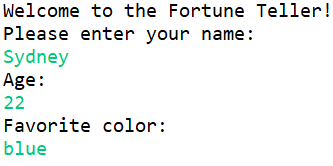

# FortuneTellerGame
This is a java program that takes information from the user and produces a positive fortune.

## **Table of Contents**

1.	[Introduction](#Introduction)
2.	[Features](#Features)
3.	[CodeExample](#CodeExample)
4.	[Installation](#Installation)
5.	[FAQ/Support](#FAQ/Support)
6.	[Contribute](#Contribute)
7.	[License](#License)

## Introduction

The fortune teller program allows the user to enter their name, age, and favorite color and produces a positive fortune based on the information given.

## Features

*	Fortune Teller will provide a positive, morale boosting fortune based on the user’s name, age, and favorite color.
* Some of the fortunes that are possible outcomes of the Forunte Teller Game include:
  * "Today is your day!"
  * "If you wish to see the best in others, show the best of yourself."
  * "Die with memories, not dreams."
* Fortune Teller allows the user to use their information (name, age, favorite color) to produce a customized good fortune.

## CodeExample
The Fortune Teller program asks the user for their name, age, and favorite color. The program then produces a postive fortune based on the user's information. 
First, the user is requested to enter their name.
The program will look like this:

Then, the user is requested to enter their age.
The program will look like this:

Then, the user is requested to enter their favorite color.
The program will look like this:

Finally, the program will execute and produce a user-specific fortune.
The program will look something like this:

## Installation

The Fortune Teller game can be reached by downloading FORTUNE_TELLER.ZIP 
First, download the file above.
Next, extract all the files to your file of choice.
Next, open the extracted file, FORTUNE_TELLER.
Last, begin the game.

## FAQ/Support

*	How do I get a different fortune?
  *	The fortunes are based on the information the user gives (name, age, favorite color)
*	What do I do if the fortune has an error or is blank?
  *	Please contact mageesj@appstate.edu for any errors or program crash

All other inquiries can be answered by mageesj@appstate.edu

## Contribute

The source code for Fortune Teller can be found [here](https://github.com/sydneymagee/FortuneTellerGame).
Please feel free to submit a pull request for Fortune Teller.

## License

Fortune Teller is licensed under the [MIT](https://github.com/sydneymagee/FortuneTellerGame/blob/master/LICENSE) license.

